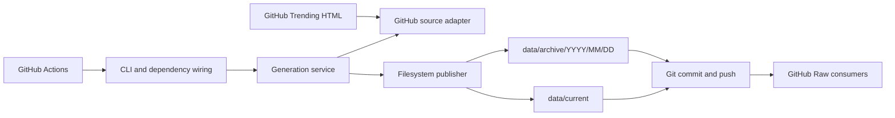

# Architecture Overview

GitHub Trending API is a scheduled data pipeline packaged as a Python CLI. It reads public GitHub
Trending HTML, maps it into a typed domain model, and publishes static JSON and RSS files that Git
and GitHub Raw serve to consumers. There is no long-running process or database.

The static publication model is recorded in
[ADR-0001](../adr/0001-static-dataset-via-github-actions.md).

## Components and boundaries

| Component | Responsibility |
| --- | --- |
| Domain | Feed, Snapshot, Snapshot Issue, Daily Rollup, statuses, and rollup merge rules. |
| Generation service | Traverse configured feeds, isolate source failures, publish successful Snapshots, and report run status. |
| GitHub source adapter | Build source URLs, pace and retry HTTP requests, recognize pages, and parse source rows. |
| Format codecs | Render JSON and RSS and decode existing JSON Daily Rollups. |
| Filesystem publisher | Derive current/archive paths, merge the current UTC rollup, and replace generated files. |
| CLI | Parse options, construct runtime dependencies, report progress and summaries, and map outcomes to exit codes. |
| GitHub Actions | Schedule Update Runs, execute quality checks, and commit generated data. |

Dependencies point inward: domain code imports neither services nor adapters; the generation
service depends on its own source, publisher, and progress protocols; the CLI wires concrete
adapters. Import Linter enforces the domain and service boundaries.

## Update flow

1. The CLI constructs 18 feeds from six language filters and three periods.
2. The generation service processes feeds sequentially and reports optional verbose progress.
3. The source adapter waits two seconds between feeds. Each request allows up to three attempts for
   network failures, HTTP 429, and server errors; numeric `Retry-After` is honored, otherwise an
   exponential delay plus bounded jitter is used.
4. The parser accepts repository rows or an explicit GitHub empty-state marker. It produces a
   complete or degraded Snapshot, or a normalized source failure for an unrecognized page.
5. The publisher renders one current JSON/RSS pair and one UTC Daily Rollup JSON/RSS pair. Existing
   rollup JSON is decoded and merged before new files are rendered.
6. The CLI prints a final summary and, in GitHub Actions, appends it to the workflow step summary.

Product semantics for this flow are defined in [Dataset Behavior](../product/dataset.md).

## Failure boundaries

Normalized source failures are isolated per Feed; later feeds continue. A malformed identifiable
row degrades its Snapshot without failing the Feed. Filesystem, rollup-decoding, and other fatal
value errors escape the generation service and terminate the CLI with exit code `1`.

All four payloads for a Feed are rendered before writing begins. Each file is written through a
sibling temporary file and atomically replaced, but the four-file publication is not a transaction:
a process interruption can leave a Feed's JSON and RSS files from different observations. The next
successful Update Run replaces them.
